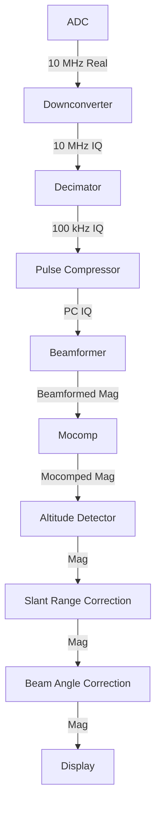

# Design

I will describe the design by describing it alongside my initial use case: a sonar dsp pipeline.

## Use Case

I have a side scan sonar that I am developing and I need a flexible, configurable, and efficient DSP pipeline to process said sonar data. The high level diagram of the needed sonar dsp chain is below.

The ADC is sampling data at 10 MHz. To start development I may save this data directly, meaning everything else in the chain would be implemented using this dsp-pipeline library. In that scenario the ADC gets replaced with some kind of reader that is reading real data that came out of the ADC. Shortly after I evaluate that the hardware is working correctly I will push the downconverter and decimator stages into the sonar to cut down the data rates and the amount of data I have to save. So then in scenario 2, I have a different reader that is reading basebanded IQ data instead of RF data from the ADC, and my python chain starts with the pulse compressor. In scenario 3 and 4 I then push the pulse compressor and the beamformer down into the sonar. So throughout the development of this sonar I may have 4 different chain configurations with 4 different readers. I hope to have the data stored in some self describing format so that the recorded data saves the information of what kind of data it is. But there may also be recordings before that is implement where I will have to tell the pipeline what kind of data there is. It would be nice if this chain is backwards compatible: so for example if some data is pulse compressed and some is not the chain would know what reader to use and to skip over the pulse compressor if needed. Lets say all of that works: I would then love to run my chain in real time and stream live data to it, so now its catching data from some streaming source instead of reading from a file.

## Architecture

### Source
We will have a generic source class that generates data (I guess it fits into the adapter pattern). It could be a file reader, a client or server catching streaming data, etc. It will take in a config in order to set itself up correctly. In the case of a self descriptive file then it will be a reader that opens the file, reads the metadata, and the configures itself. In the case of the streaming data, it might need to catch a piece of data first to know what kind of data its getting to configure itself. It could also be another pipeline for example to take non pulse compressed data and spit out pulse compressed data for a pipeline that does not contain a pulse compressor. The source will also be given a callback function to call once its configured describing its configuration. So lets say we want to read a data file, do some processing, and then save the semi processed output to an intermediate file. If we have a self descriptive file, or file with metadata such as "recording date" we may want to pass that along to the writer so it can add that to the intermediate file. So the flow is we create the source, it then grabs the first bit of data, configures itself, lets everyone know about its config, and then passes that first bit of data to who is next in the pipeline. Its kind of a one time observer pattern. The source will also one function for grabbing data: one to read the next bit of data which is what will be used in the pipeline. Every read it will output the data itself which is most likely a numpy array, and the metadata which could be a dictionary that has every other bit of information that goes along with the data that we want to pass along. 

